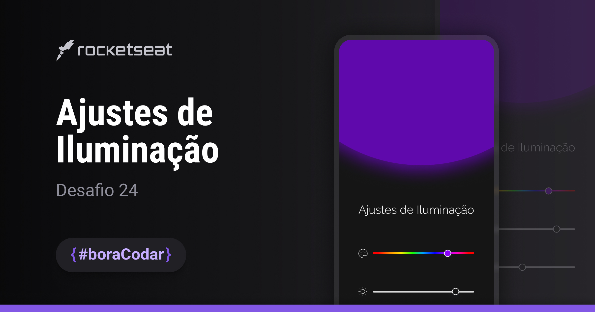

<!-- title page -->
<h1 align="center"> Light App</h1>

<!-- nav -->

  <a href="#-tecnologias">Tecnologias</a>&nbsp;&nbsp;&nbsp;|&nbsp;&nbsp;&nbsp;
  <a href="#-projeto">Projeto</a>&nbsp;&nbsp;&nbsp;|&nbsp;&nbsp;&nbsp;
  <a href="#-layout">Layout</a>

<!-- cover -->

  

## 🚀 Tecnologias
Esse projeto foi desenvolvido com as seguintes tecnologias:

- HTML e CSS
- Git e Github
- JavaScript

 

## 💻 Projeto
O projeto <strong>Light App</strong> é uma aplicação que simula um ajuste de iluminação, desenvolvido de forma independente como desafio da série #BoraCodar da [Rocketseat](https://www.rocketseat.com.br/).  

Neste projeto foram desenvolvidas soluções em <strong>HTML</strong> e <strong>CSS</strong>, aplicando soluções semânticas e modernas. Além disso, seus foram inteiramente produzidos com <strong>JavaScript</strong>.

> [Navegue pela aplicação aqui](https://rkt-bcd-24-light-app.vercel.app/)

 

## 🔖 Layout
Desenvolvido por [Daniel Duarte](https://www.linkedin.com/in/daniel2d/), Product Designer na Rocketseat, você também pode acessar o [layout do projeto aqui](https://www.figma.com/proto/oQYTgXwIpORjZqgiPvtFFt/Ajustes-de-Ilumina%C3%A7%C3%A3o-%E2%80%A2-Desafio-24--Community-?page-id=3%3A376&node-id=707-3&viewport=169%2C143%2C0.41&t=TFDfHDc01xlDs9xF-1&scaling=min-zoom&content-scaling=fixed).